# AFUE Analysis Tool

The README for AFUE Analysis Tool Manual was written by Zhiming Gao (gaoz@ornl.gov). The AFUE analysis tool for residential and light commercial furnaces follows ANSI/ASHRAE Standard 103-2017 (i.e. Method of Testing for Annual Fuel Utilization Efficiency (AFUE) of Residential Central Furnaces and Boilers) 

The usage of the open-source tool is subjected to MIT License

# Introduction 

The AFUE analysis of residential and light commercial furnaces follows ANSI/ASHRAE Standard 103-2017 (i.e. Method of Testing for Annual Fuel Utilization Efficiency (AFUE) of Residential Central Furnaces and Boilers) [1, 2]. The tool analysis is a complex and comprehensive method based on furnace configuration and specific components equipped, and requires detailed furnace testing and measurement data. Thus, an AFUE analysis tool using Microsoft Excel enabled with VBA was developed with user-friendly interface, easy-to-use and comprehensive coverage. The tool consists of three worksheets: unit and configuration selection, geometry and measurement data input, and AFUE plus key results. This tool can be used to estimate the AFUE of both condensing and non-condensing furnaces with single-stage, two-stage and step-modulating functions. The tool was validated with experimental data from ORNL commercially available natural gas furnaces, including a 40 kBTU/h two-stage non-condensing furnace and an 80 kBTU/h non-modulating condensing furnace. The AFUE of the condensing furnace was rated at 96% while the tool evaluated a value of 95.9%. The AFUE of the non-condensing furnace was rated at 80% while the tool evaluated 81.4%. The results indicate the tool is reasonably accurate in the evaluation of new R&D modified furnace unit. 

# AFUE Analysis Tool Configuration and Usage
The AFUE tool consists of three worksheets: unit and configuration selection, geometry and measurement data input, AFUE plus key results, and Helps.

- __Unit and configuration selection__

Figure 1 shows the details of the worksheet, named as **SelectScenario**, for unit and configuration selection in the tool. Users can select (1) __condensing or non-condensing furnace scenarios__; (2) __natural gas furnace system configuration scenarios__, shown in the attached table, in which allows system number 3, 6 and 9 for condensing furnace scenarios or system number 1-10 for non-condensing furnace scenarios; and (3) __modulating types__, including non-modulating, two-step modulating and continuous-step modulating modes. Figure 2 displays these selection options. Once users select these options, the tool will show and highlight the exact unit selected, helping users to ensure the correct selections.

Moreover, users are allowed to adjust the selected system characteristics, including (1) __Indoor Combustion Air__; (2) __Outdoor, Direct Vent or Isolated Combustion System__; (3) __Direct Exhaust__; (4) __Draft Hood or Draft Diverter__; (5) __Barometric Draft__; (6) __Electrical/Mechanical Stack Damper__; (7) __Atmospheric Burner__; (8) __Power Burner__; (9) __Burner Inlet Damper or Flue Damper__; (10) __Other Select Inputs__ such as __Post Purge__ and __Pilot Light__. Users can adjust these system characteristics at the cell of __User Inputs__, while the values shown in the cell of __Generic__ are default inputs. In addition, the tool provides the options for British-Unit and SI-Unit. The details are displayed in Figure 3. While users adjust these options, the tool will simultaneously show and highlight the exact system characteristics selected, helping users to check the adjustment correction.

After completing unit and configuration selection, the button of __Start__ allows users to move to the **DATAINPUT** worksheet of geometry and measurement data input. 

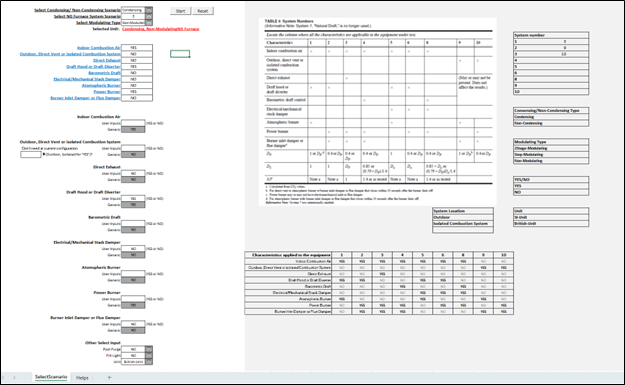

Fig. 1: Unit and configuration selection in the AFUE Analysis Tool.

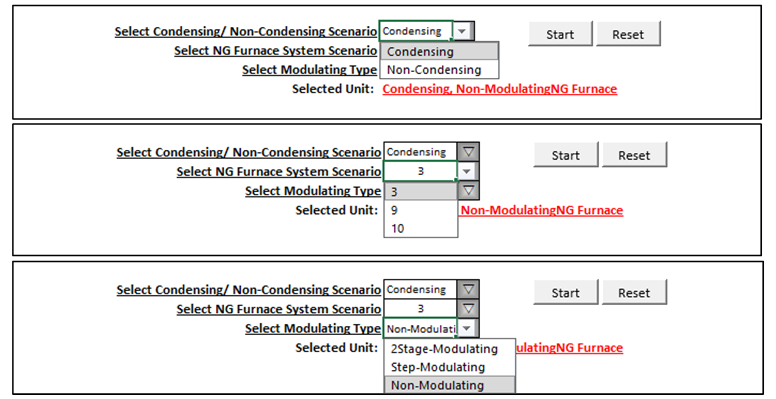

Fig. 2: The user-friendly interface used for unit and configuration selection.

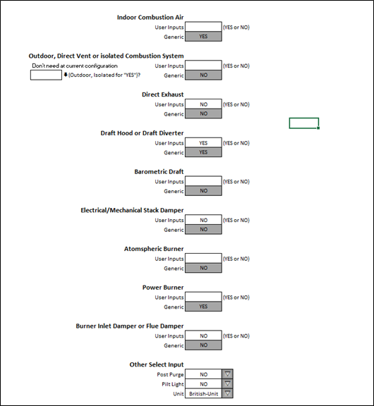

Fig. 3: Specific adjustment on the selected system characteristics

- __Geometry and measurement data input__

The __DATAINPUT__ worksheet for geometry and measurement data input is presented after clicking the button of __Start__ in the worksheet of SelectScenario. Figure 4 shows part of the __DATAINPUT__ worksheet with an example of non-modulating condensing furnace. In the given worksheet, users can add furnace testing data, including the data measured from __steady-state test__, __cool-down test__, __heat-up test__, __post purge__, __pilot light__, and __jacket surface energy loss__. If a condensing furnace is selected, the worksheet requires to add __collected condensate data__ from both __steady-state test__ and __cyclic test__. 

Figure 5 displays the __steady-state test__ data input for an example of non-modulating condensing furnace. The steady-state data inputs include __natural gas flow rate__, __heating rate__, __electric power to the burner__, __flue gas temperatures__, __dry gas CO2 concentration__, c__ollected condensate__, __jacket surface temperature__ and __room temperature__. If the selected furnace is a non-condensing unit, the __collected condensate__ will not be displayed in the worksheet. 

Figure 6 shows the data input for __cool-down test__, __heat-up test__, __cumulated condensate__, __post purge__, __pilot light__ at a given example of condensing, non-modulating furnace. Figure 7 shows the data inputs for __jacket surface energy loss__.

If the selected furnace is either two-step modulating or step-modulating mode, the __DATAINPUT__ worksheet will require additional inputs for __reduced heating mode__. The details are shown in Figures 8 and 9. Figure 10 shows data inputs for __jacket surface energy loss__ for either two-step modulating or continuous-step modulating mode, and the modes  also require additional inputs for __reduced heating mode__. 

If users selected a furnace that fit system 5, 6, 8 or a unit with Stack/Damper, the worksheet requires to input __furnace Stack/Damper parameter__, which is shown in Figure 11.

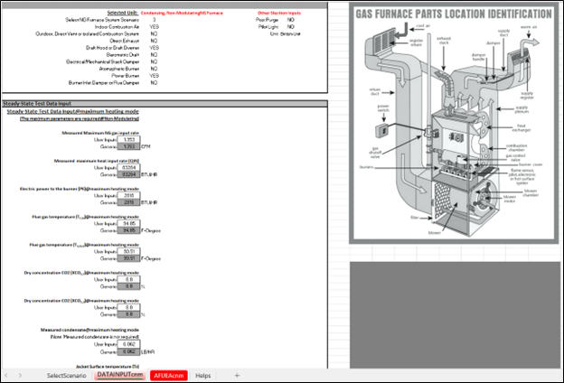
 
Fig. 4: The geometry and measurement data input in an example of non-modulating condensing furnace in the AFUE Analysis Tool. 

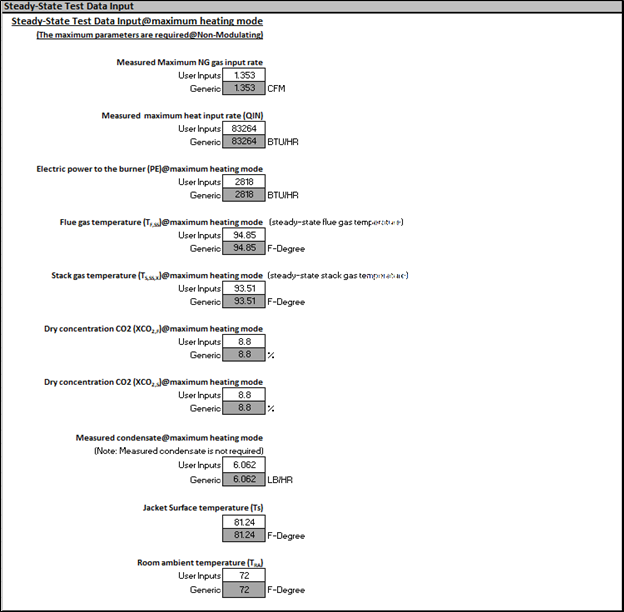

Fig. 5: Steady-state test data inputs at a given example of non-modulating condensing furnace operating at maximum heating mode.
 
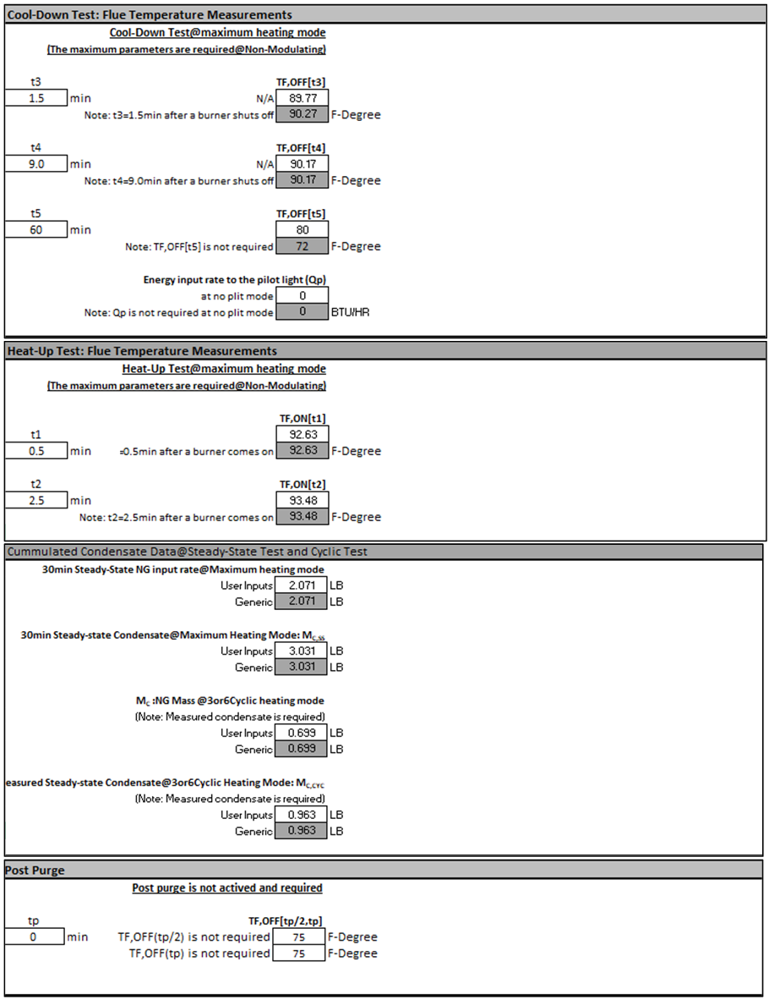 
 
Fig. 6: Data inputs measured from cool-down test, heat-up test, cumulated condensate, post purge, and pilot light (included in cool-down test) at a given example of non-modulating condensing furnace operating at maximum heating mode.

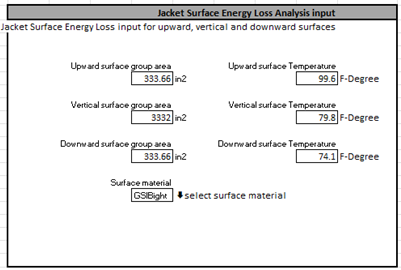
 
Fig. 7: Data inputs for jacket surface energy loss at a given example of non-modulating condensing furnace operating at maximum heating mode.

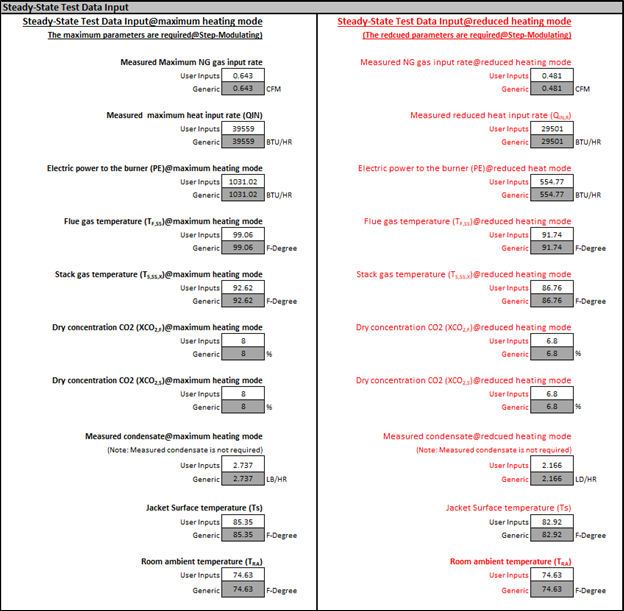
 
Fig. 8: Steady-state test data inputs for both maximum and reduced heating modes at a given example of step-modulating condensing furnace.

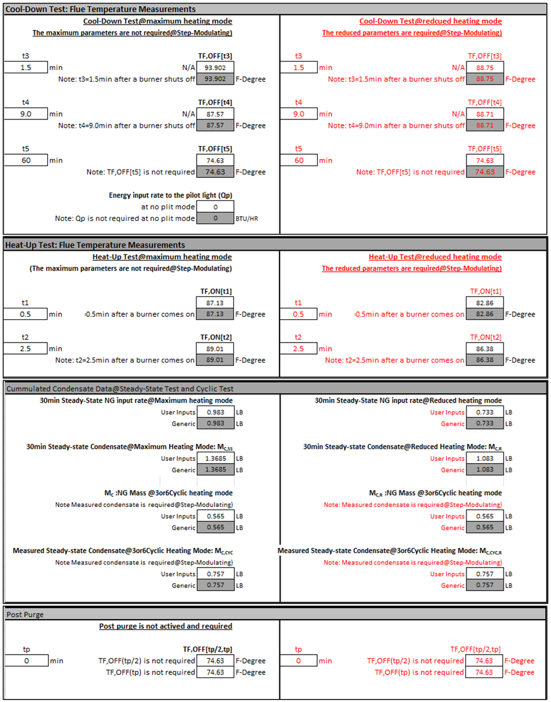 
 
Fig. 9: Data inputs for both maximum and reduced heating modes on cool-down test, heat-up test, cumulated condensate, post purge, and pilot light (included in cool-down test) at a given example of step-modulating condensing furnace.

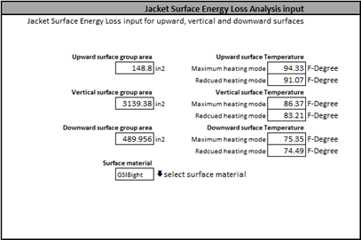
 
Fig. 10: Data inputs for jacket surface energy loss at a given example of step-modulating condensing furnace.

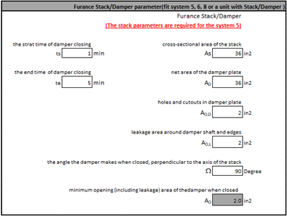
 
Fig. 11: Data inputs for furnace Stack/Damper parameter (fit system 5, 6, 8 or a unit with Stack/Damper).

- __AFUE plus key results__

The __AFUEA__ worksheet shows __AFUE__ and other key results, including __stead-state testing constants__, __heat capacity and part-load constants__, __calculating part-load seasonal efficiency__, __calculating part-load seasonal efficiency__, and __calculations affected by outside air, EFFySS, AFUE__. The __AFUEA__ worksheet does not need users’ inputs. 

Figures 12 and 13 show the AFUE results for non-modulating no-condensing furnace and step-modulating condensing furnace, respectively. 

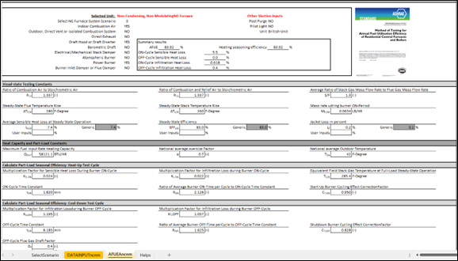
 
Fig. 12: AFUE for non-modulating no-condensing furnace

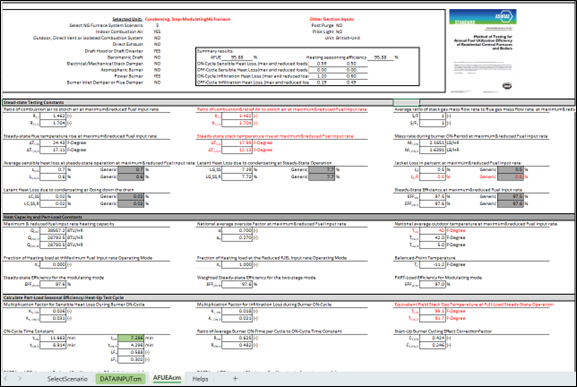
 
Fig. 13: AFUE for step-modulating condensing furnace.

- __Others: Helps__

The tool also provides a worksheet for __help__s, in which a brief manual is provided for how to run the tool. The details are shown below. 

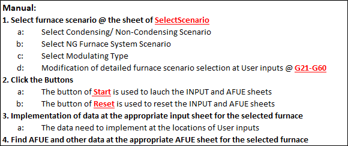
 
Fig. 14: A brief manual for how to use the tool.

 
# Reference

1.	ANSI/ASHRAE. ANSI/ASHRAE 103-2017: method of testing for annual fuel utilization efficiency of residential central furnaces and boilers. 2017.
2.	Gao, Z, Gluesenkamp, K, Gehl, A., Pihl J., LaClair, T., Zhang, M., Sulejmanovic, D., Jeffrey M., Nawaz K., (2021) “Ultra-clean condensing gas furnace enabled with acidic gas reduction,” Energy, 243:123068.
